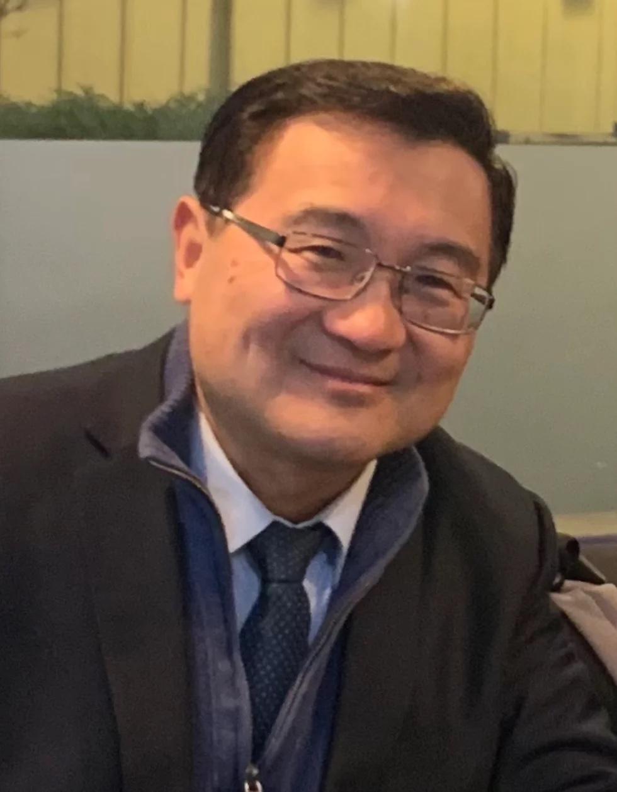
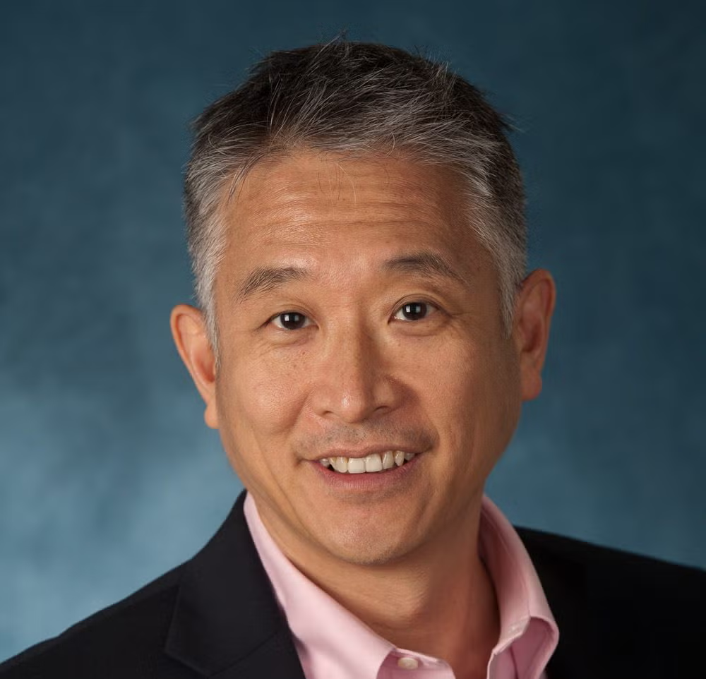

# CCFN 2026 Retreat

## June 12-14, 2026

**Location:** Pepperdine University

Join us for the **CCFN 2026 Retreat**, a weekend of worship, fellowship, teaching, and renewal on the beautiful campus of Pepperdine University.

[Register for the Retreat](https://afcinc.churchcenter.com/registrations/events/3241955) | [View Pepperdine University on Google Maps](https://www.google.com/maps/search/?api=1&query=Pepperdine%20University)

---

## Event Details

| Item | Details |
|---|---|
| **时间** | Friday, June 12, 2026 - Sunday, June 14, 2026 |
| **地点** | [Pepperdine University](https://www.google.com/maps/search/?api=1&query=Pepperdine%20University) |
| **主题** | 进入 |

---

## Keynote Speakers

### 张路加牧师

**张路加牧师**原为材料工程师。在中国大学时代重生得救，于德国柏 林理工大学材料所深造期间蒙召全职事奉，在美国完成宣教及神学 方面的装备，获宣教硕士、道学硕士及教牧博士学位。张牧师先后 在美国洛杉矶和德国曼海姆拓植并牧养教会。担任「播种者」国际 协会 (The Sowers international) 远东事工部主任至今逾三十年，参 与《欧洲校园事工》（Europe Campus Ministry）在欧洲的服侍迄今 逾二十年。目前也担任“隐藏的吗哪”（Hidden Manna International）网络宣教事工的执行主席，致力于藉网路传扬主的真 道。

 

### Dr. Charles Lee / 李勉群教授

**李勉群教授**是华盛顿大学福斯特商学院的汉森会计学教授。他也是斯坦福大學商學院管理和會計Moghadam家族講座退休教授。李教授研究人類認知限制對於投資者的效率的影響，因而市場合併此因素以調整價格方面的研究。他的研究有許多人尾隨，他也得到許多榮譽，包括 AAA（美國會計協會）的FARS 终身成就奖和十二項國家級和學校級的最佳教書獎。他曾是AAA最高學者，他也榮獲斯坦福大學亞裔美籍教授的成就和服務獎。从 2004 年到 2008 年，李博士担任巴克莱全球投资公司（BGI；现为 Blackrock）的董事总经理。 作为全球股权研究主管和北美主动股权联席主管，他领导了公司的全球主动股权研究团队，并共同负责其北美主动股权业务。 在他任职期间，BGI管理着超过 3000 亿美元的主动股权资产。

李教授和妻子，Lily都是基督徒。 在過去的年歲裡，他們分別在密西根大學，康奈爾
大學，伯克萊大學, 斯坦福大學, 和华盛顿大学服事校園的研究生和訪問學者，做佈道
和門徒訓練的工作。他們二位常在基督教會，工作坊及年會做講員。李教授曾參與基
督使者協會董事會，也曾多次是“真理論壇”的講員。他們結婚四十三年，有兩個孩
子Mark和 Monica.

 

---

## Retreat Schedule

A full retreat schedule will be announced soon.

| Date | Program |
|---|---|
| **Friday, June 12** | Arrival, check-in, opening session |
| **Saturday, June 13** | Keynote sessions, workshops, fellowship activities |
| **Sunday, June 14** | Worship, closing session, departure |

---

## Registration

[Register online for the CCFN 2026 Retreat](https://afcinc.churchcenter.com/registrations/events/3241955).

---

## Contact

For questions about the CCFN 2026 Retreat, please contact the retreat organizing team.

---

*We look forward to seeing you at the CCFN 2026 Retreat!*

